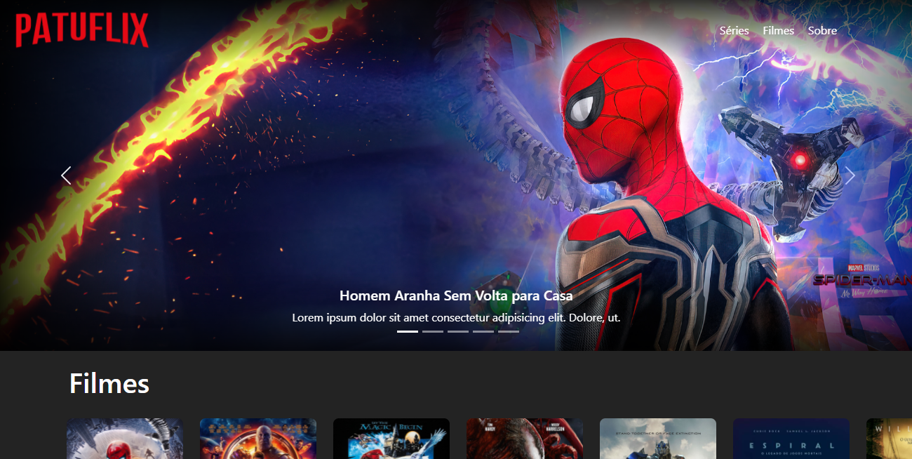

# Bem vindos ao 

Site feito para fins de estudo da framework Bootstrap e um pouco de UI/UX. Tenta imitar o site/app da Netflix em alguns aspectos como:

- Lista de filmes com o ultimo item pela metade para gerar curiosidade ao usuário;

 - Carousel com filmes passando com informações para o usuário;
 - Carousel preenchendo a header toda.

 Vão ser adicionadas mais coisas como:

:heavy_plus_sign: Funcionalidades no nav como ela seguir a pagina;

:heavy_plus_sign: Animações em algumas coisas;

:heavy_plus_sign: Hover em alguns itens;

:heavy_plus_sign: Lista de filmes funcional;

:heavy_plus_sign: Página dedicada aos "Parceiros" e o Quem somos.

